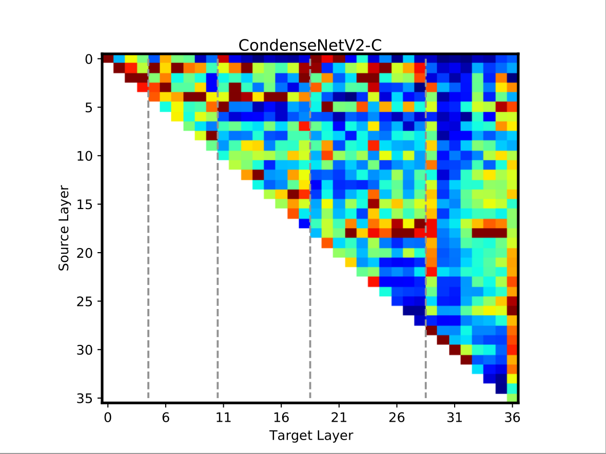

# Visualization

The code `plot_weight_layer_level.py` is used to generate the Figure.7 (d) in our paper.

## Usage
Download the unconverted model from the unconverted CondenseNetV2-C model from [Tsinghua Cloud](https://cloud.tsinghua.edu.cn/f/4e4a5246fc6249829ab0/?dl=1) / [Google Drive](https://drive.google.com/file/d/12efJqELir4tzPMP-gdsH3Kl6kc5WeJgf/view?usp=sharing).

```
python plot_weight_layer_level.py --model_name CondenseNetV2-C \
  --checkpoint_path /PATH/TO/CHECKPOINT_FILE \
  --out_path /PATH/TO/OUTPUT_DIR
```

## Visualization Result
Figure 7(d) in the paper.

